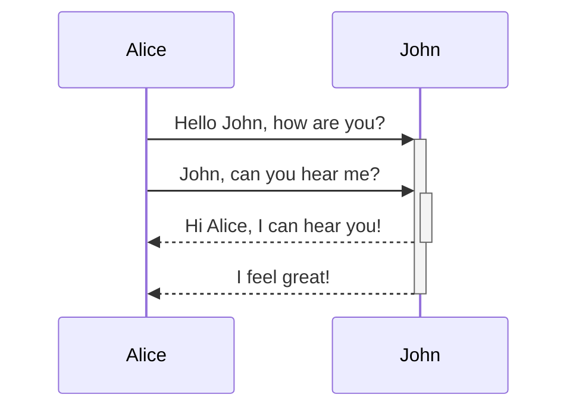
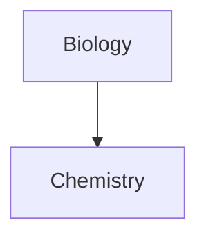

## AI notes
Notes for the learning of ai things using obsidian.

## Tagging
 #todo #ai #vectordatabase #aitools #aiparsers #aiarchitecturepatterns #aiagents 

## Functions

- Create new note: CMD + n
- Create new note in new pane: Cmd + shift + n
- Search: ctrl + shift + f
- open quick switch: ctrl + o
- create new Folder: probably not needed since we are following the Zettelkasten method.
- Internal Link: [[Start Here]] [[]] 
	- you can ctrl + enter when inside the brackets to create a new one from there
- add image: drag and drop

## Styles
- # Heading 1 : #*1
- ## Heading 2: # * 2
- ### Heading 3: # * 3
- #### Heading 4:  # * 4
- **Bold** : ** or cmd + b
- *italic*: * or cmd + i
- ==Highlighter:== == 
- Quotes: >
> "this is a quote"

- dividers: ---
---

## Lists
- checklists : CMD + Endter x2
- Bullet List : - 
- Number list: number + period + space

## Views
- One a new pane: cmd + click on note
- link panes to scroll both 

#### Callouts
[callouts](https://help.obsidian.md/Editing+and+formatting/Callouts)
> [!important]

>[!info]

>[!note]
>This is inside the call out

>[!tip]

>[!faq]  hello

> [!question] Can callouts be nested?
> > [!todo] todo Yeah!
> > > [!example] example wohoo!

> [!quote] > 
> Lorem ipsum dolor sit amet

> [!abstract] 
>  Lorem ipsum dolor sit amet

#### Comments:
%%
this is a comment
%%

### Diagrams

### Image Storage:
store in attachment folder, changed in settings

## Templates
 - settings > core plugins > templates
 - folder is templates
 - interpolation
	 - {{title}}
	 - {{date}}
	 - {{time}}

## Plug-ins 
No plugins